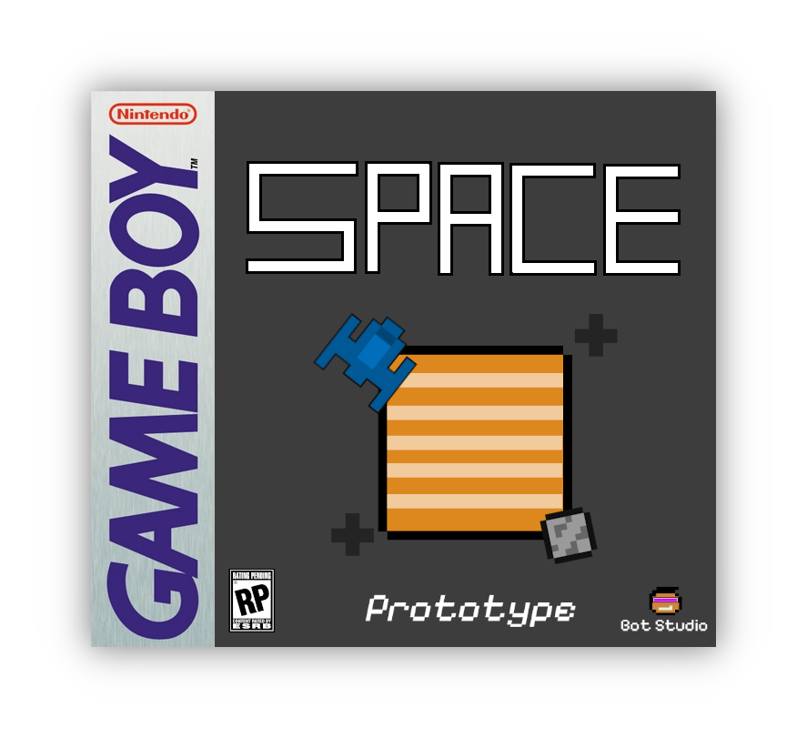
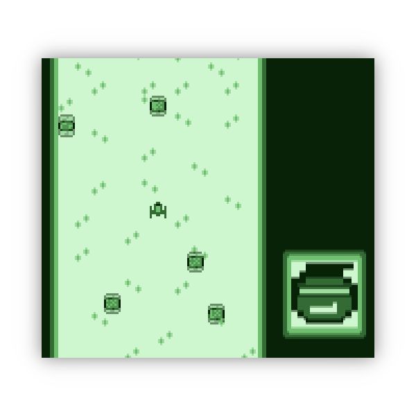

<!-- PROJECT LOGO -->
<h1 align="center">
  <br>
  <a href="https://github.com/BotRandomness/SpaceGB"></a>
  <br>
  <b>Space</b>
  <br>
  <sub><sup><b>Space, a lost retro space explorer Gameboy homebrew, written in GBZ80 Assembly.</b></sup></sub>
  <br>

</h1>

<a href="https://github.com/BotRandomness/SpaceGB">
    
</a>

<p align="center">
<strong>The Gameboy, something that is special to <em>me</em>.</strong> I did <em>not grow up with the Gameboy</em>, but the first game I released publically was actually a Gameboy game. However, I did not use assembly for that. Recently, I got really <strong>interested about learning more about the Gameboy's hardware</strong>. After doing some reading, I thought why not make another <strong>Gameboy game, but using assembly!</strong> That way, I get to learn the basics of the Gameboy's hardware, while creating a game along side to <strong>learn about the hardware, in a programmer perspective.</strong> Along the way, I got to do <em>full on programming</em> with assembly for the first time! Just like what <strong>developers for the Gameboy did back in the late 80s and 90s.</strong> Wouldn't that be fun! About the game it self, it's really simple. Matter of fact, currently there is no title screen, end screen, or score counter, just yet, but the basic game mechanic is there. Just a Space Ship dodging asteroids. While you are reading this, I might as well tell you a little "story" about this game. The idea/vibe behind this game is supposed to be a <strong>"lost prototype" of a "unfinished" game</strong> from 90s resurfacing in modern times <em>(sound familiar)</em>. Is this just an excuse for the game looking the way it is, and how unfinshed it is? <strong>I don't know, you tell me ;)</strong>   
</p>

</div>

<!-- ABOUT THE PROJECT -->

## Getting Started
Want to use it, or mess around, or just to see how it works? Here is how you get started!
### Download
1. Download `space.gb` from [here](https://github.com/BotRandomness), or on the releases page.
2. Have any Gameboy emulator (Emulicious, BGB, mGBA, etc.), or even real hardware, on a real Gameboy!
3. You are ready to go!
### Controls
- D-Pad to move around
- (A) for accelerate boost
- (B) for reverse boost
### Gameplay
Move around, and dodge asteroids! Use your boost as a assist, but don't use it too much, you don't know a when an asteroid will come out! Have fun! :)

## Screenshots
<a href="https://github.com/BotRandomness/SpaceGB">
    
</a>
<p align="center"> Screenshots of game play </p>

### Demo Gameplay
<a href="https://github.com/BotRandomness/SpaceGB"></a>

## Compile
Want to tinker around, modify, make your own, learn a bit about gameboy development, or contribute? Here's how you can get started with the code and compile.

To get started, you need to have RGBDS install. RGBDS is the assembler we use.

1. Download RGBDS: https://rgbds.gbdev.io/
2. Clone this repository, and point your terminal to the root directory of the repository
3. Set up with your build system like make, or just stright copy commands in `build.txt`, or copy below
4. The commands will assemble, link, and then fix the ROM (More information can be found in the RGBDS docs: https://rgbds.gbdev.io/docs/v0.8.0)
```
rgbasm src/main.asm -i src/ -o build/main.o
rgblink build/main.o -o build/main.gb
rgbfix -v -p 0xFF build/main.gb
```
In theory, when testing and making Gameboy games, you can use any Gameboy emulator. However it is best to use an accurate Gameboy emulator, which bascially means as what is sounds like. An accurate emulator behaviours a lot more closer to the real heardware, giving more accurate results on how it would run on real hardware. Also a emulator with a debugger is really useful. I recommend Emulicious (Windows, MacOS, Linux) or BGB (Windows only), both are accurate Gameboy emulators with debuggers. I used both, but I used Emulicious the most since it's up to date and has more debugging features. There also a lot more options out there, so pick whatever works best for you.   

### Program Architechture
Here's a little information on the program layout!

Looking over the code, the program is quite simple, don't worry! This portation was written to be simple, so no matter of your skill level, anybody should get the idea of the program works, it's sort of the reason why I write these parts! :)

Assembly code can be differnet from processor to processor, due to different architecture and instruction set. The Gameboy uses the Sharp LR35902, which is based on the Zilog Z80, which itself is based on the [Intel 8080](https://github.com/BotRandomness/GO-8080). Writing assembly code for any platform involves (somewhat), a linear way of following though. In assembly, we work with registers and memoary directly. There are parts of the code, such as the beginning header, which are specific set of instructions to set up the Gameboy. This includes reserving space for the header, and also loading in Tile data, tile map data, and sprite data to memory. The rest of code then follows the logic of the game. Here is a snip bit:
```asm
Main:
    ; Wait until it is not in VBlank
    ld a, [rLY]
    cp 144
    jp nc, Main
WaitVBlank2:
    ld a, [rLY]
    cp 144
    jp c, WaitVBlank2

    ; Update to scroll background up
    ld a, [rSCY]
    dec a 
    ld [rSCY], a

    ; Update asteroid positions
    ld a, [_OAMRAM + 4]
    cp a, 150
    jp z, ResetAsteroid ; Reset asteroid if past on Y, with random X value
    add 2
    ld [_OAMRAM + 4], a
    jp Asteroid1Done
ResetAsteroid:
    ld a, 0
    ld [_OAMRAM + 4], a
    call Random2
    ld [_OAMRAM + 5], a
Asteroid1Done:
```

You may have notice something being called `Random2`. That is a label, basically points to a part in memoary to jump your code to. This how the program is divided into two. When in the second VBlank, the game updates it's logic and visuals on screen. That is the first part, the second part is where we have "functions". Assembly doesn't really have function, but we can use labels. At the bottom of the program, there are labels which perform a specfic functions, like to generate random numbers, or to dectect collision, and they all end with the `ret` instruction. The `ret` instruction returns the program back to where the program was call from in memoary (remember assembly follows a linear flow, and we said labels are friendly memoary addresses, and we jump to that part of program in memoary). Here is an example:
```asm
; Checks overlap collision between 2 8x8 sprite tiles
; Param: reg b,c -> Y1, X1 (SpaceShip)
; Param: reg d,e -> Y2, X2 (Asteroid)
; Returns back if no collision, else resets game
CheckCollision:
    ; Asteroid right side >= Spaceship left side
    ld a, e          
    add 8 ; Asteroid's right side, X2 + 8
    cp c             
    jp c, NoCollision

    ...
NoCollision:
    ret
```
Most of the code follows this approach. The code itself is commented, so it should be easy to follow. 
For information on the syntaxs and instruction set of GBZ80, the RGBDS docs does a great job laying out with full information: https://rgbds.gbdev.io/docs/v0.8.0/gbz80.7
More infomation about the Gameboy hardware itself can be found in PansDocs: https://gbdev.io/pandocs/

## Resources
Great resources that helped out, and also are good reads:
- RGBDS docs: https://rgbds.gbdev.io/docs/v0.8.0/gbz80.7
- PansDocs: https://gbdev.io/pandocs/
- GB ASM Tutorial: https://gbdev.io/gb-asm-tutorial/ (I recommend this, great starting point, very useful!)
- Rodrigo Copetti's Gameboy/Color Architecture Practical Analysis: https://www.copetti.org/writings/consoles/game-boy/

These Resources were so useful, I recommend anyone give them a read if you are interested!

## Upcoming Features

- [ ] Add Title screen
- [ ] Add End screen
- [ ] Score Counter
- [ ] Add Sound
- Post any feature request in the Issues tab!

## Known issues

- [ ] General code refactor
- If you find other bugs/issues, open up a issue in the Issue tab

## Contributing

This project is open-source under the MIT License, meaning your free to do what ever you want with it. This project is freely available for anyone to contribute, assembly experts, Gameboy lovers, retro enthusiast, or someone who is new to it all.

If you plan on contributing, a good place to start is to look at upcoming wanted features, and known issues. If you find a new bug, or have feature ideas of your own, posted first to the Issues tab before hand. You can even fork it and make it your own! </br>

To get started on contributing:

1. Fork or Clone the Project
2. Once you have your own repository (it can be a public repository) to work in, you can get started on what you want to do!
3. Make sure you git Add and git Commit your Changes to your repository
4. Then git push to your repository
5. Open a Pull Request in this repository, where your changes will be look at to be approved
6. Once it's approved, it will be in a development branch, soon to be merge to the main branch

<!-- LICENSE -->

## License

Distributed under the MIT License. See `LICENSE` for more information.
